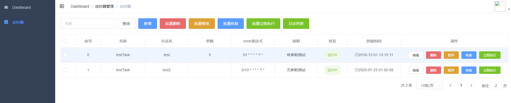
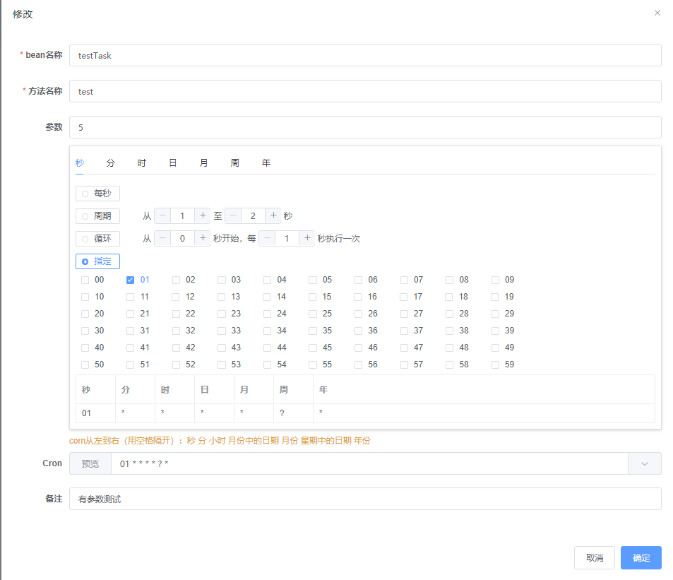
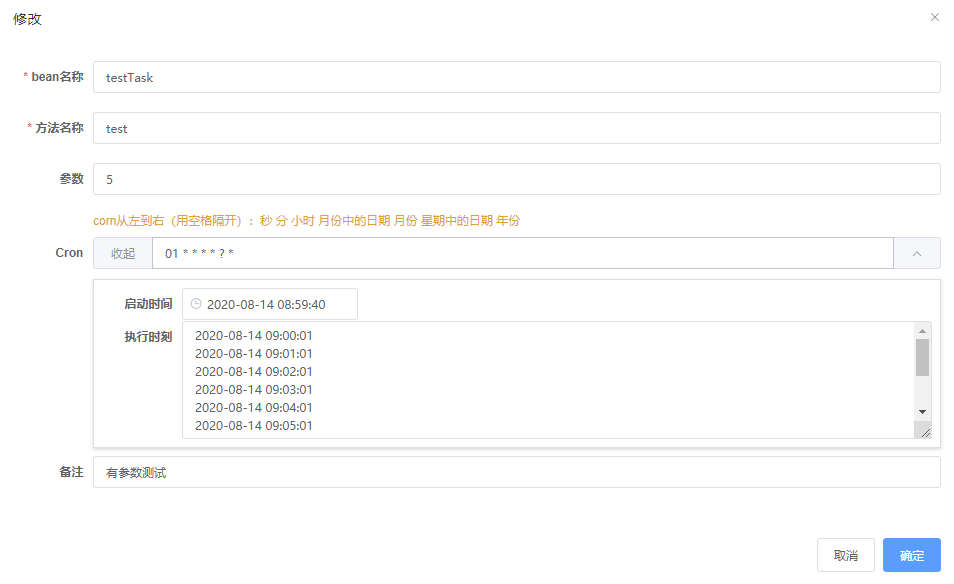

# vue-admin-template

官方说明：
> 这是一个极简的 vue admin 管理后台。它只包含了 Element UI & axios & iconfont & permission control & lint，这些搭建后台必要的东西。

## Build Setup

```bash
# 克隆项目
git clone https://github.com/PanJiaChen/vue-admin-template.git

# 进入项目目录
cd vue-admin-template

# 安装依赖
npm install

# 建议不要直接使用 cnpm 安装以来，会有各种诡异的 bug。可以通过如下操作解决 npm 下载速度慢的问题
npm install --registry=https://registry.npm.taobao.org

# 启动服务
npm run dev
```

浏览器访问 [http://localhost:9528](http://localhost:9528)
 
 
 ### 变动说明：
 1.去掉mock教程 [去掉mock教程](https://blog.csdn.net/weiiscomeon/article/details/96695526)
 2.除去不需要的路由,以及追加新增界面路由[统一说明，不再赘述]
 
 
### 功能新增日志：
1.动态定时器
引用 [vue-cron](https://gitee.com/lindeyi/vue-cron)
配套后台 [定时器后台接口](https://github.com/Blankwhiter/dynamic-schedule)

### 文件变动列表
1.添加文件 
1.1 vue-cron
├─components
│  ├─cron
│  └─cron.vue

1.2 定时器列表界面
└─views
    ├─job
    
1.3 定时器服务器接口 
 ├─api
 │  ├─job.js
 

###  界面一览






2.视频播放
使用`vue-video-player`插件
### 模块安装
```
npm install vue-video-player -S
```

### 文件变动列表
1.添加文件 
1.1 播放器界面
└─views
    ├─video
    
1.3 加入组件
 ├─main.js
 ```
  import VueVideoPlayer from 'vue-video-player'
  import 'video.js/dist/video-js.css'

  Vue.use(VueVideoPlayer, /* {
    options: global default options,
    events: global videojs events
  } */)
 ```